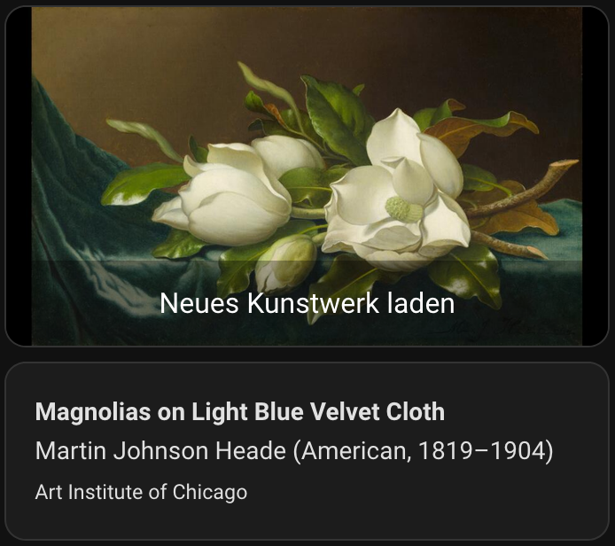

# Frame Gallery 0.1.0b2 validation

Recorded on 2026-10-04. This report distinguishes observed software results
from physical TV observation, which the user explicitly deferred.

## Exact build and publication evidence

Runtime/source commit: `f3d916c1519f86482a740c7dda54767d8ad99092`.
[Publisher run](https://github.com/volkue-tech/frame-gallery-ha/actions/runs/37223299682)
passed all five jobs. Native ARM and Intel actual-image suites each passed
4,914 tests with five root-only skips; all five separate root checks passed.
Both architectures passed 26 image measurements under the real 1 GiB
`RLIMIT_AS`. These are native results, not an emulated Intel substitute.

- ARM: `ghcr.io/volkue-tech/frame-gallery-ha-aarch64@sha256:9e58bd22eaa4171025ff6b650b1de4a568ecb20a9254766786fade2597650e42`
- Intel: `ghcr.io/volkue-tech/frame-gallery-ha-amd64@sha256:765a87631cc044a1fc6e16c91a3bbc67cb92643409fccb6c8640365aaf57441a`

Anonymous pulls verified architecture, revision and version labels. Tag/digest
manifest bytes match. Independent Cosign 3.1.3 checks passed with issuer
`https://token.actions.githubusercontent.com`, the exact runtime SHA, and
certificate identity
`https://github.com/volkue-tech/frame-gallery-ha/.github/workflows/publish.yml@refs/heads/codex/artwork-info`.
The signature names the actual candidate ref, not `main`.

[Matching sources](https://github.com/volkue-tech/frame-gallery-ha/releases/tag/sources-v0.1.0b2):
172 upstream archives, 521,646,080 bytes; SHA256
`b5ac1de25f01dac9def0e855d35bb9e88f3ba24ddb0410ef9173cbd79b2846a5`.
The anonymous download passed hashing and exact-snapshot/member preflight.
All 26 dependency pins and original component notices are unchanged. Both
one-time publisher variables were disabled again and read back.

## Approved existing-installation test on Home Assistant Green

The existing public-store app was updated from b1 to b2 through its UI, with
**keep the previous version's backup** enabled. The installed version was
confirmed as 0.1.0b2. No uninstall, data reset, SSH or configuration.yaml edit
was used. Backup creation was requested; a backup restore was not tested here.

A dedicated Text helper was created and its settings reopened: minimum 0,
maximum 255, Text mode, no fixed Initial value. Only the explicit loading-timer
and artwork-information helper options were added. A separate native test
stack reused the original camera, timer and script; the original card was not
edited. The app's autostart and automatic-update switches remained off.

| Observed run (UTC) | Result |
| --- | --- |
| 19:04:28 | `delivered`, 19.4 s; AIC 44018, Winslow Homer, **Croquet Scene**. Protocol markers: connected, upload_started, uploaded, selected. Preview and title/artist/museum rendered together in the native stack; text persisted after a browser reload. |
| 19:07:03 | `delivered`, 16.6 s; AIC 100829, Martin Johnson Heade, **Magnolias on Light Blue Velvet Cloth**. Preview and all three information fields changed; previous sent-work exclusions increased from 3 to 4. |
| 19:07:52 | Cleveland modern European painting/sculpture with period before 1400: `no_match`, 1.2 s, hint `filters too restrictive`. No TV selection; previous preview and Heade caption remained. |
| 19:09:12 | Safe invalid unspecified TV address: `config_invalid`, 0.0 s. Refused before TV communication; previous preview and caption remained. |

Loading completion was acknowledged on each run and the loading notes ended.
Every observed storage summary reported zero temporary files and zero run
directories. The preview bucket retained one latest image; after the second
delivery it stayed at 1,150,450 bytes across both negative runs. This is bounded
run evidence, not a claim that all storage on the Green was audited.

The original source, unrestricted filters, real TV address and fitting settings
were restored and saved. The new explicit timer and information-helper settings
remain enabled for the user's optional card.

## Restart and remaining scope

The user separately approved one HA Core restart. It was performed once through
the System UI with no running automation/script reported by its confirmation
dialog. A fresh browser reload after disconnection showed the same Heade caption
and, after the Local File integration loaded, the same magnolia preview. No app
start or helper rewrite was used to recover them. The UI subsequently reported
that Home Assistant had fully started. Other integrations are outside this
feature's validation scope.

Only the two cards were selected in Firefox's native region-screenshot tool;
no sidebar, account, notifications, calendar, camera tokens or address bar are
included. Image provenance and the work's public-domain metadata verification
are recorded in [documentation visuals](docs/images/README.md).

Physical TV display confirmation is pending by the user's choice. The
`selected` protocol marker is not a visual observation. Fresh pairing,
every TV model, new kernel-negative probes and a backup restore were not
retested. TV transport failure and metadata-service failure ordering remain
covered by synthetic tests, not induced live failures in this pass.

The engineering licence assessment remains an engineering record, not
independent legal counsel. Project-owned code is Apache-2.0; the runtime's
separately licensed GPL/LGPL components, notices and corresponding sources
remain unchanged.

## Completion-document checks

The full local gates were repeated after the guide/report/screenshot updates:
Ruff passed, strict host and Linux mypy passed over 244 files, 4,908 tests passed
with eleven unchanged platform/root-only skips. Whole-package line and branch
coverage was 100% (9,272 statements, 2,002 branches); the architecture-required
subset also passed its 100% gate. `git diff --check` passed. No runtime code,
dependency or signed image changed in this documentation completion.
