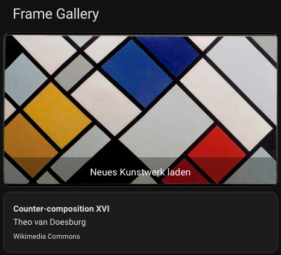
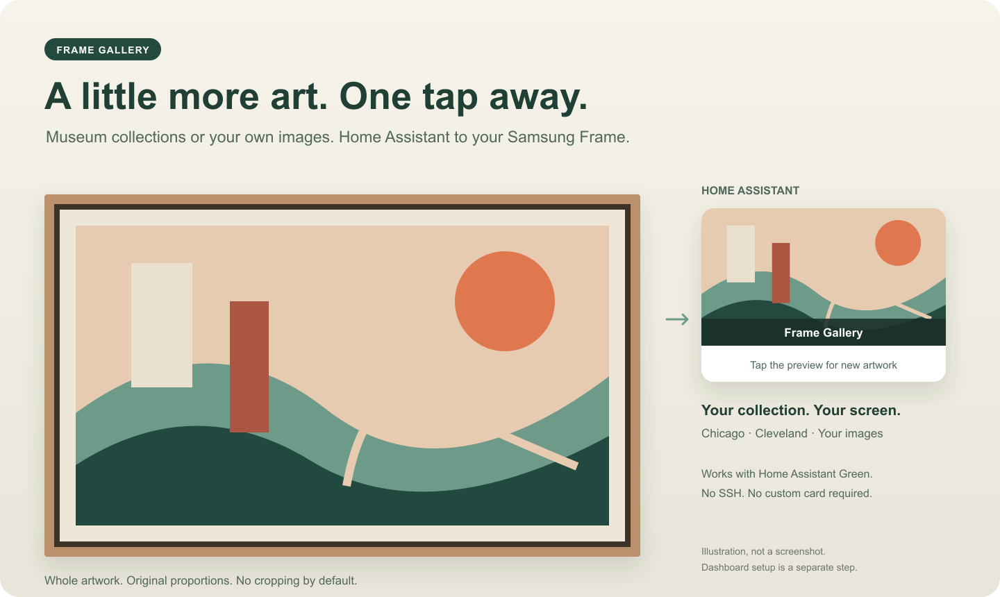

# Frame Gallery for Home Assistant

Fresh artwork on your Samsung Frame. Start it with a tap from Home Assistant.

> **Next release, not published yet:** 400 curated Commons works (166 retained
> plus 234 new), Commons first/default for new installations, and a clearer
> setup guide. The public Store release below remains **0.1.0b4 / 166 works**.

*Actual Green screenshot from b3; the optional dashboard is set up separately. Theo van Doesburg, [Counter-composition XVI](https://commons.wikimedia.org/w/index.php?curid=3817033), Commons reproduction with public-domain metadata checked on 2026-10-05. The user confirmed this work on the TV. This is historical evidence, not a new-release live test.*

**[Add to Home Assistant](https://my.home-assistant.io/redirect/supervisor_add_addon_repository/?repository_url=https%3A%2F%2Fgithub.com%2Fvolkue-tech%2Fframe-gallery-ha)** · [Setup guide](frame_gallery/DOCS.md) · [Latest beta](https://github.com/volkue-tech/frame-gallery-ha/releases/tag/v0.1.0b4)

## Art first. No unwanted cropping.

- **A broad, colourful collection, museum artwork or your own images.** b4 includes 166 near-widescreen Wikimedia Commons works, alongside the Art Institute of Chicago, the Cleveland Museum of Art, or your local JPEG/PNG collection. No API key needed.
- **Keep the whole work.** Original proportions are preserved by default; margins fill any unused space. Cropping is opt-in.
- **Something new.** Previously sent artworks are skipped while new eligible works remain. History keeps the latest 20 000 works.
- **See it before the next tap.** The optional native Home Assistant card shows the latest successful preview and starts a new run.
- **Know the artwork.** Optionally add its title, artist and museum below the preview with one Text helper and built-in cards. The basic card stays unchanged.
- **Made for Home Assistant OS, including Green.** Pre-built ARM and Intel/AMD images. No SSH, Docker installation, HACS, or `configuration.yaml` edits.

### One artwork. Your TV and an optional dashboard.

*Product illustration, not a screenshot. The optional dashboard card is added separately using the guide below. Tap the real card's preview to request another work; its label can be renamed.*

## Get your first artwork

1. **Install.** [Add the repository](https://my.home-assistant.io/redirect/supervisor_add_addon_repository/?repository_url=https%3A%2F%2Fgithub.com%2Fvolkue-tech%2Fframe-gallery-ha), then open **Settings → Apps → App store → Frame Gallery – Samsung Frame TV → Install**.
2. **Configure.** Enter your TV's fixed private IPv4 address in the app's **Configuration** tab and save. Leave **Watchdog off**: this app intentionally stops after each run.
3. **Start.** Switch the TV on, start the app, and accept its connection prompt on the TV within 20 seconds. Check the **Log** tab for `outcome=delivered`.

You need Home Assistant OS with Supervisor, Home Assistant 2026.2 or newer, and a compatible Samsung Frame on the same home-network subnet. Home Assistant Container and Core-only installations cannot install this app.

**The dashboard is optional, not installed automatically.** First try the app from its own page. Then follow the [dashboard setup](frame_gallery/DOCS.md#dashboard): create a preview camera and a timer in the UI, and paste the complete script and card examples. No custom card is required. The guide also includes a complete daily automation.

Already have the standard card? In 0.1.0b2 and newer, follow the separate
[artwork-information guide](frame_gallery/ARTWORK_INFO.md) to add optional
title/artist/museum text. Reuse your camera, timer and script; no extra dashboard
extension is needed.

When adding **Local File**, replace its default name with **Frame Gallery Preview**. It automatically creates the image's camera entity; no physical camera is needed. The guide explains how to find its actual entity ID and select the right preview in the card editor.

## Choose your collection

| Source | Available filters in this beta |
| --- | --- |
| Wikimedia Commons | 400 prepared for the next release; b4 has 166. Shared fitting options |
| Art Institute of Chicago | Period |
| Cleveland Museum of Art | Department and period |
| Your own images | Landscape and fitting options |

Landscape selection and screen-shape preference work with all four sources. **Colour and style filters are not available yet.** Google Arts & Culture is not a source in this app. Museum sources use documented open-access APIs and eligible CC0 images; Commons uses a curated selection with current rights and file identity rechecked on each run; local media uses your own files.

**For the wide Commons collection:** choose `wikimedia_commons`, keep **Landscape
only** on and **Image fit = contain**. b4 sources are within 2.5% of 16:9;
leave **Prefer 16:9** on for the closest matches (about 1%), or turn it off
for the whole selection. Small margins can remain; the complete art is preserved.
No account, API key or new dashboard helper is required. See the
[collection and rights notes](frame_gallery/COMMONS.md).

The default prefers landscape works close to 16:9. If no suitable new work is found within the search budget, it can fall back to a landscape work with margins, without cropping. See [all options and filter values](frame_gallery/DOCS.md#options).

## Need help?

- [Installation and first pairing](frame_gallery/DOCS.md#installation)
- [Dashboard card and daily automation](frame_gallery/DOCS.md#dashboard)
- [Common questions](frame_gallery/DOCS.md#common-questions)
- [Log messages and what to do](frame_gallery/DOCS.md#reading-the-log)
- [Known limitations](frame_gallery/DOCS.md#good-to-know)
- [Report a problem](https://github.com/volkue-tech/frame-gallery-ha/issues)

When reporting a problem, include the app version, TV model and the final outcome line. Remove personal details and secrets before sharing logs. Do not include pairing tokens, passwords or access tokens.

## Public beta

[0.1.0b4](https://github.com/volkue-tech/frame-gallery-ha/releases/tag/v0.1.0b4)
expands the Commons selection to 166 near-widescreen JPEG works from 112 artist
labels. All 200 research proposals are retained; 34 require further rights,
proportion or source-format review. Matching public sources, both native
validators and actual images, anonymous pulls and independent signatures passed.
See the [b4 validation report](BETA4_VALIDATION.md). No new Green/TV live validation
is claimed for this catalogue update. Update in place; existing options,
dashboard helpers and sent-image history stay compatible.

[0.1.0b3](https://github.com/volkue-tech/frame-gallery-ha/releases/tag/v0.1.0b3)
adds 50 curated Commons works and clearer English/German configuration. Native
ARM/Intel checks, independent signatures, an in-place Green update, two distinct
deliveries, preview/caption/loading/cleanup and physical confirmation of the
second work passed in the [recorded b3 scope](BETA3_VALIDATION.md).

[0.1.0b2](https://github.com/volkue-tech/frame-gallery-ha/releases/tag/v0.1.0b2)
adds optional artwork information. Native ARM/Intel image checks passed, and an
existing public Green installation was upgraded and software-tested without a
data reset. Physical TV confirmation for those b2 runs is deferred by the user;
protocol success is not a visual observation. See the [b2 validation scope](BETA2_VALIDATION.md).

[0.1.0b1](https://github.com/volkue-tech/frame-gallery-ha/releases/tag/v0.1.0b1) was tested on Home Assistant Green and a real Samsung Frame: installation from the public repository, artwork delivery, preview refresh, loading completion and temporary-file cleanup passed in the documented scope. This is not a guarantee for every TV model; first-time pairing on every model has not been verified.

The app runs once, then stops. It does not remove artworks already stored on your TV. It remembers the latest 20 000 deliveries; very old artworks can eventually return. [Read the limitations](frame_gallery/DOCS.md#good-to-know) before relying on unattended use.

## For contributors

Frame Gallery is implemented independently. The project's own code is [Apache-2.0](LICENSE); distributed third-party components retain their own licences. The runtime is not GPL-free. [Third-party notices](THIRD_PARTY_NOTICES.md) and [matching component sources](https://github.com/volkue-tech/frame-gallery-ha/releases/tag/sources-v0.1.0b4) are available; historical b1/b2/b3 source releases are retained.

- [Developer setup and quality gates](frame_gallery/DEVELOPMENT.md)
- [Product specification](PRODUCT_SPEC.md) · [Architecture](ARCHITECTURE.md) · [Acceptance tests](ACCEPTANCE_TESTS.md)
- [Current status](STATUS.md) · [Tasks](TASKS.md) · [Decision log](DECISIONS.md) · [Independent-development boundaries](LEGAL_BOUNDARIES.md)
- [Green/TV test report](PHASE8_REPORT.md) · [Public-beta validation](PHASE9_REPORT.md) · [Final ARM/Intel validation run](https://github.com/volkue-tech/frame-gallery-ha/actions/runs/37193338410)
- [Sources and rebuilding](SOURCE_AND_REBUILD.md) · [Release process](RELEASE_PROCESS.md) · [Engineering licence assessment](ENGINEERING_LICENSE_REVIEW.md)

## Attribution

The product idea is inspired by community experimentation around Home Assistant and Samsung Frame art-mode automation. No predecessor code is incorporated. Frame Gallery is an independent project, not affiliated with or endorsed by Samsung, the museums, or Home Assistant.
