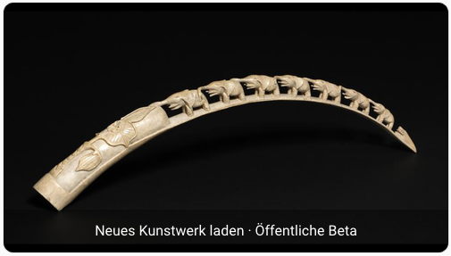

# Frame Gallery for Home Assistant

Fresh artwork on your Samsung Frame. Start it with a tap from Home Assistant.

*Product illustration, not a screenshot. The optional dashboard card is added separately using the guide below.*

**[Add to Home Assistant](https://my.home-assistant.io/redirect/supervisor_add_addon_repository/?repository_url=https%3A%2F%2Fgithub.com%2Fvolkue-tech%2Fframe-gallery-ha)** · [Setup guide](frame_gallery/DOCS.md) · [Latest beta](https://github.com/volkue-tech/frame-gallery-ha/releases/tag/v0.1.0b1)

## Art first. No unwanted cropping.

- **Museum artwork or your own images.** Choose the Art Institute of Chicago, the Cleveland Museum of Art, or your local JPEG/PNG collection.
- **Keep the whole work.** Original proportions are preserved by default; margins fill any unused space. Cropping is opt-in.
- **Something new.** Previously sent artworks are skipped while new eligible works remain. History keeps the latest 20 000 works.
- **See it before the next tap.** The optional native Home Assistant card shows the latest successful preview and starts a new run.
- **Made for Home Assistant OS, including Green.** Pre-built ARM and Intel/AMD images. No SSH, Docker installation, HACS, or `configuration.yaml` edits.

### The real dashboard card

*Screenshot from the working public-beta installation. Tap the image to request another work; the label can be renamed. Artwork: [“Elephant Bridge” souvenir](https://www.clevelandart.org/art/1929.342), Cleveland Museum of Art, 1929.342, [CC0 Open Access](https://www.clevelandart.org/open-access).*

## Get your first artwork

1. **Install.** [Add the repository](https://my.home-assistant.io/redirect/supervisor_add_addon_repository/?repository_url=https%3A%2F%2Fgithub.com%2Fvolkue-tech%2Fframe-gallery-ha), then open **Settings → Apps → App store → Frame Gallery → Install**.
2. **Configure.** Enter your TV's fixed private IPv4 address in the app's **Configuration** tab and save. Leave **Watchdog off**: this app intentionally stops after each run.
3. **Start.** Switch the TV on, start the app, and accept its connection prompt on the TV within 20 seconds. Check the **Log** tab for `outcome=delivered`.

You need Home Assistant OS with Supervisor, Home Assistant 2026.2 or newer, and a compatible Samsung Frame on the same home-network subnet. Home Assistant Container and Core-only installations cannot install this app.

**The dashboard is optional, not installed automatically.** First try the app from its own page. Then follow the [dashboard setup](frame_gallery/DOCS.md#dashboard): create a preview camera and a timer in the UI, and paste the complete script and card examples. No custom card is required. The guide also includes a complete daily automation.

## Choose your collection

| Source | Available filters in this beta |
| --- | --- |
| Art Institute of Chicago | Period |
| Cleveland Museum of Art | Department and period |
| Your own images | Landscape and fitting options |

Landscape selection and screen-shape preference work with all three sources. **Colour and style filters are not available yet.** Google Arts & Culture is not a source in this app. The museum sources use documented open-access APIs and eligible CC0 images; local media uses your own files.

The default prefers landscape works close to 16:9. If no suitable new work is found within the search budget, it can fall back to a landscape work with margins, without cropping. See [all options and filter values](frame_gallery/DOCS.md#options).

## Need help?

- [Installation and first pairing](frame_gallery/DOCS.md#installation)
- [Dashboard card and daily automation](frame_gallery/DOCS.md#dashboard)
- [Common questions](frame_gallery/DOCS.md#common-questions)
- [Log messages and what to do](frame_gallery/DOCS.md#reading-the-log)
- [Known limitations](frame_gallery/DOCS.md#good-to-know)
- [Report a problem](https://github.com/volkue-tech/frame-gallery-ha/issues)

When reporting a problem, include the app version, TV model and the final outcome line. Remove personal details and secrets before sharing logs. Do not include pairing tokens, passwords or access tokens.

## Public beta

[0.1.0b1](https://github.com/volkue-tech/frame-gallery-ha/releases/tag/v0.1.0b1) was tested on Home Assistant Green and a real Samsung Frame: installation from the public repository, artwork delivery, preview refresh, loading completion and temporary-file cleanup passed in the documented scope. This is not a guarantee for every TV model; first-time pairing on every model has not been verified.

The app runs once, then stops. It does not remove artworks already stored on your TV. It remembers the latest 20 000 deliveries; very old artworks can eventually return. [Read the limitations](frame_gallery/DOCS.md#good-to-know) before relying on unattended use.

## For contributors

Frame Gallery is implemented independently. The project's own code is [Apache-2.0](LICENSE); distributed third-party components retain their own licences. The runtime is not GPL-free. [Third-party notices](THIRD_PARTY_NOTICES.md) and [matching component sources](https://github.com/volkue-tech/frame-gallery-ha/releases/tag/sources-v0.1.0b1) are available.

- [Developer setup and quality gates](frame_gallery/DEVELOPMENT.md)
- [Product specification](PRODUCT_SPEC.md) · [Architecture](ARCHITECTURE.md) · [Acceptance tests](ACCEPTANCE_TESTS.md)
- [Current status](STATUS.md) · [Tasks](TASKS.md) · [Decision log](DECISIONS.md) · [Independent-development boundaries](LEGAL_BOUNDARIES.md)
- [Green/TV test report](PHASE8_REPORT.md) · [Public-beta validation](PHASE9_REPORT.md) · [Final ARM/Intel validation run](https://github.com/volkue-tech/frame-gallery-ha/actions/runs/37193338410)
- [Sources and rebuilding](SOURCE_AND_REBUILD.md) · [Release process](RELEASE_PROCESS.md) · [Engineering licence assessment](ENGINEERING_LICENSE_REVIEW.md)

## Attribution

The product idea is inspired by community experimentation around Home Assistant and Samsung Frame art-mode automation. No predecessor code is incorporated. Frame Gallery is an independent project, not affiliated with or endorsed by Samsung, the museums, or Home Assistant.
